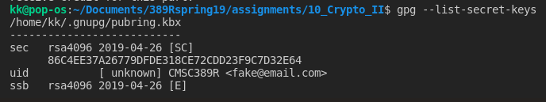

# Crypto II Writeup

Name: *Kyle Liu*
Section: *0101*

I pledge on my honor that I have not given or received any unauthorized
assistance on this assignment or examination.

Digital acknowledgement: *Kyle Liu*

## Assignment Writeup

### Part 1 (70 Pts)

I loaded the secret key with gpg by running ```gpg --import key.asc``` and decrypted the file by running ```gpg --decrypt message.txt.gpg```.

I found the flag ```CMSC389R-{m3ss@g3_!n_A_b0ttl3}``` in the document.



The cleartext signature I got by running ```gpg --cleartext signature.txt``` is in the writeup folder.

### Part 2 (30 Pts)


